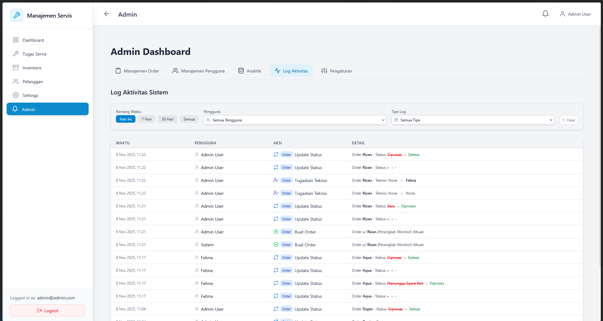
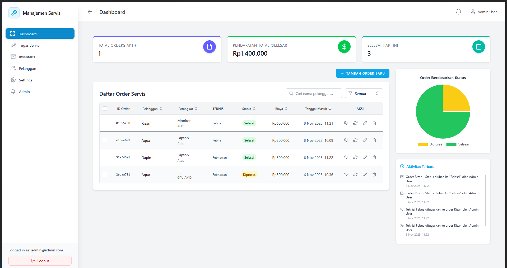
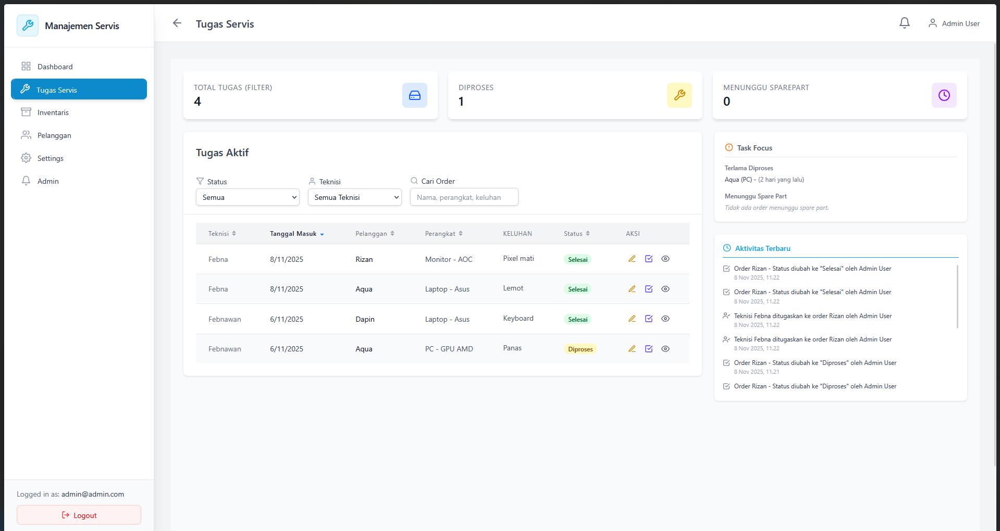
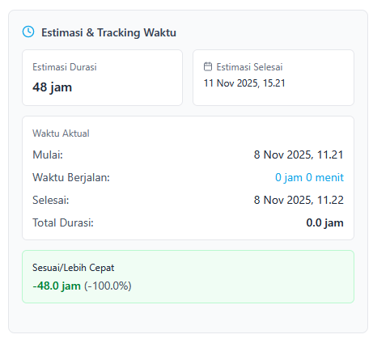
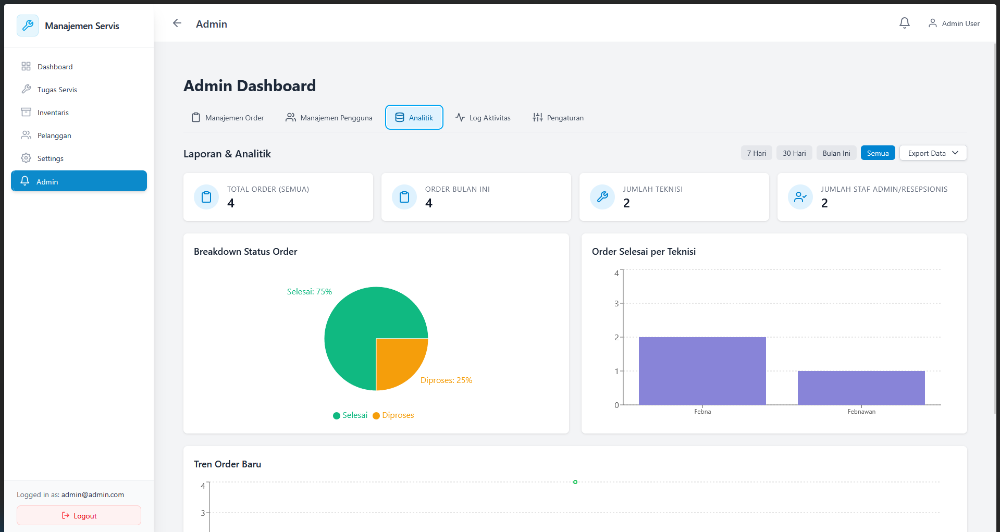

# 🔧 Service Management System

> A comprehensive web-based service management application built with React and Supabase

[](https://reactjs.org/)
[](https://vitejs.dev/)
[](https://supabase.com/)
[](https://tailwindcss.com/)

Aplikasi manajemen servis elektronik yang dirancang untuk mempermudah alur kerja service center, dari penerimaan order hingga penyelesaian, dengan sistem role-based access control dan real-time tracking.

---

## 📋 Table of Contents

- [Overview](#-overview)
- [Key Features](#-key-features)
- [Screenshots](#-screenshots)
- [Tech Stack](#-tech-stack)
- [Getting Started](#-getting-started)
- [Project Structure](#-project-structure)
- [User Roles](#-user-roles)
- [Contributors](#-contributors)

---

## 🎯 Overview

Aplikasi ini dikembangkan sebagai solusi digital untuk mengelola proses servis barang elektronik dengan efisien. Sistem ini mendukung berbagai peran pengguna (Admin, Resepsionis, Teknisi) dengan hak akses yang disesuaikan untuk setiap peran.

**Built for:** Tugas Ujian Akhir Semester (UAS) - Mata Kuliah Sistem Informasi  
**Program Studi:** Informatika, Semester 4

---

## ✨ Key Features

### 🔐 Authentication & Authorization
- Secure login system with Supabase Auth
- Role-based access control (Admin, Resepsionis, Teknisi)
- Protected routes and component-level permissions

### 📊 Role-Specific Dashboards

#### Admin Dashboard
- Complete order management and monitoring
- User management (create, edit, delete users)
- Advanced analytics and performance metrics
- System activity logs
- System settings and configurations

#### Receptionist Dashboard
- Create and manage service orders
- Customer database management
- Assign technicians to orders
- Update order status
- Real-time order tracking
- Export orders to PDF/Excel

#### Technician Dashboard
- View assigned service orders
- Start/complete work tracking with timestamps
- Update order progress
- View order details and customer information
- Performance statistics

### ⏱️ Time Estimation & Tracking
- Set estimated completion time for each order
- Automatic time tracking when work starts/completes
- Calculate actual vs estimated duration
- Performance accuracy metrics
- Real-time elapsed time counter

### 📦 Inventory Management
- Stock tracking for spare parts
- Add, edit, delete inventory items
- Stock adjustment with history logs
- Low stock alerts
- Inventory value estimation
- Read-only mode for technicians

### 📈 Analytics & Reporting
- Order status breakdown (pie charts)
- Orders per technician (bar charts)
- Order trend analysis (line charts)
- Time estimation accuracy metrics
- Export reports to PDF/Excel

### 🔔 Real-time Features
- Activity feed with recent order updates
- Status change notifications
- Toast notifications for all actions
- Auto-refresh data

### 🎨 Modern UI/UX
- Responsive design (mobile, tablet, desktop)
- Clean and intuitive interface
- Smooth animations and transitions
- Dark/light mode support
- Accessible components (ARIA labels)

---

## 📸 Screenshots

> **Note:** Place your screenshots in a `docs/screenshots/` folder in the project root

### Admin Dashboard

*Complete control panel with analytics, user management, and system settings*

### Receptionist Dashboard

*Order management interface with customer database and assignment features*

### Technician Dashboard

*Work tracking interface with time estimation and order details*

### Time Tracking

*Real-time work tracking with estimated vs actual duration comparison*

### Analytics

*Visual analytics with charts showing order trends and technician performance*

---

## 🛠️ Tech Stack

### Frontend
| Technology | Version | Purpose |
|------------|---------|---------|
| **React** | 19.0.0 | UI Framework |
| **Vite** | 6.2.0 | Build Tool & Dev Server |
| **TailwindCSS** | 4.1.3 | Utility-first CSS Framework |
| **React Router** | 7.5.0 | Client-side Routing |
| **Recharts** | 2.15.2 | Data Visualization |
| **React Icons** | 5.5.0 | Icon Library |
| **React Hot Toast** | 2.5.2 | Toast Notifications |
| **date-fns** | 4.1.0 | Date Utilities |
| **jsPDF** | 3.0.1 | PDF Generation |
| **xlsx** | 0.18.5 | Excel Export |

### Backend (BaaS)
| Technology | Purpose |
|------------|---------|
| **Supabase** | PostgreSQL Database |
| **Supabase Auth** | User Authentication |
| **Supabase Realtime** | Live Data Updates |

### Development Tools
- ESLint for code linting
- PostCSS & Autoprefixer for CSS processing
- Supabase CLI for database management

---

## 🚀 Getting Started

### Prerequisites

Before you begin, ensure you have the following installed:
- **Node.js** (v18 or higher)
- **npm** or **yarn**
- **Supabase Account** (free tier available)

### Installation

1. **Clone the repository**
   ```bash
   git clone https://github.com/feb027/manajemen-servis.git
   cd manajemen-servis
   ```

2. **Install dependencies**
   ```bash
   npm install
   ```

3. **Configure Environment Variables**
   
   Create a `.env` file in the project root:
   ```env
   VITE_SUPABASE_URL=your_supabase_project_url
   VITE_SUPABASE_ANON_KEY=your_supabase_anon_key
   ```
   
   > Get your Supabase credentials from your [Supabase Dashboard](https://supabase.com/dashboard) → Project Settings → API

4. **Set up Database**
   
   Run the SQL migrations in your Supabase SQL Editor:
   ```bash
   # Navigate to supabase folder
   cd supabase
   
   # Execute setup files in order:
   # 1. setup.sql
   # 2. create-inventory-table.sql
   # 3. Other migration files as needed
   ```

5. **Start Development Server**
   ```bash
   npm run dev
   ```
   
   The app will run at `http://localhost:5173` (or another port if 5173 is in use)

### Building for Production

```bash
# Build the project
npm run build

# Preview production build
npm run preview
```

The production-ready files will be in the `dist/` directory.

---

## 📁 Project Structure

```
manajemen-servis/
├── public/               # Static assets
├── src/
│   ├── assets/          # Images, fonts, etc.
│   ├── components/      # Reusable React components
│   │   ├── layout/     # Header, Sidebar
│   │   ├── modals/     # Modal components
│   │   └── ...         # Feature-specific components
│   ├── contexts/        # React Context providers
│   │   └── AuthContext.jsx
│   ├── layouts/         # Page layouts
│   ├── pages/           # Route pages
│   │   ├── AdminDashboard.jsx
│   │   ├── ReceptionistDashboard.jsx
│   │   ├── TechnicianDashboard.jsx
│   │   └── ...
│   ├── supabase/        # Supabase client config
│   ├── App.jsx          # Main app component
│   └── main.jsx         # App entry point
├── supabase/            # Database migrations & functions
│   ├── migrations/     # SQL migration files
│   └── functions/      # Edge Functions
├── .env                 # Environment variables (create this)
├── package.json
├── vite.config.js
└── tailwind.config.js
```

---

## 👥 User Roles

### 🔴 Admin
**Full system access**
- Manage all service orders
- Create, edit, and delete users
- View analytics and reports
- Configure system settings
- Access activity logs
- Full inventory control

### 🟡 Resepsionis (Receptionist)
**Order & customer management**
- Create new service orders
- Manage customer database
- Assign technicians to orders
- Update order status
- View order statistics
- Export reports
- Full inventory control

### 🟢 Teknisi (Technician)
**Work execution focus**
- View assigned orders
- Start/stop work tracking
- Update order progress
- View order details
- Personal performance stats
- Read-only inventory access

---

## 🤝 Contributors

<table>
  <tr>
    <td align="center">
      <a href="https://github.com/feb027">
        <br />
        <sub><b>Febnawan Fatur Rochman</b></sub>
      </a>
    </td>
    <td align="center">
      <a href="https://github.com/Renasyaa">
        <br />
        <sub><b>Renasya Malkahaq</b></sub>
      </a>
    </td>
  </tr>
</table>

---

## 📝 License

This project was created for educational purposes as part of the Information Systems course final exam.

---

## 🙏 Acknowledgments

- Built with [React](https://reactjs.org/) and [Vite](https://vitejs.dev/)
- Powered by [Supabase](https://supabase.com/)
- Styled with [TailwindCSS](https://tailwindcss.com/)
- Icons from [React Icons](https://react-icons.github.io/react-icons/)

---

<div align="center">
  <p>Made with passion for better service management</p>
  <p>⭐ Star this repo if you find it useful!</p>
</div>
